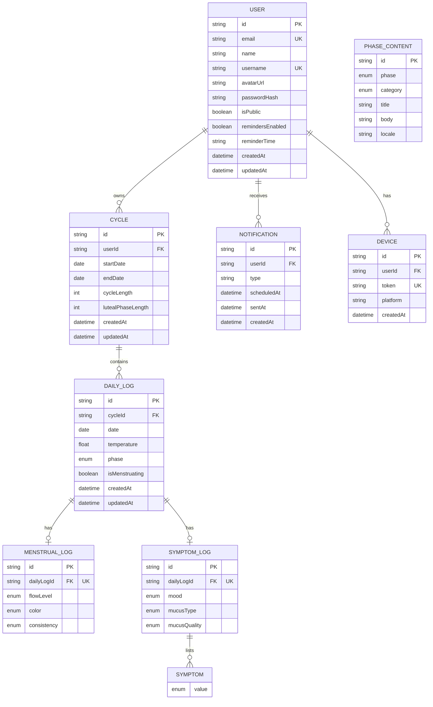
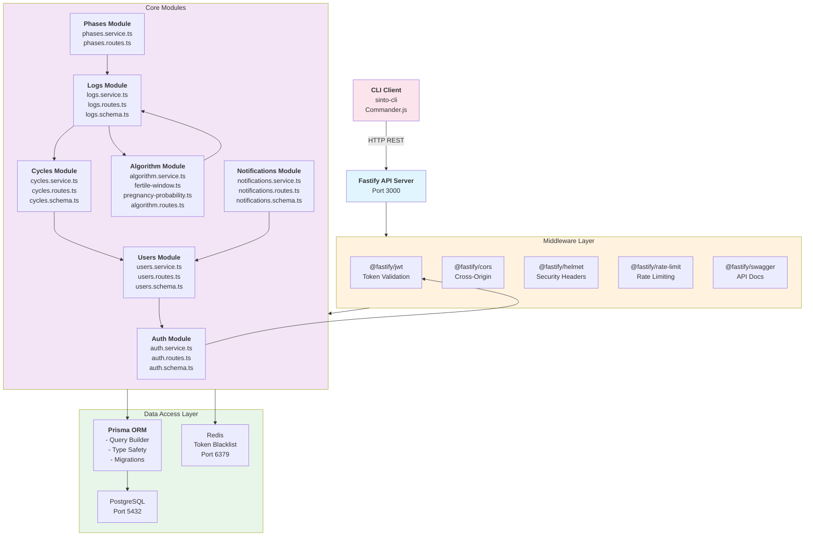
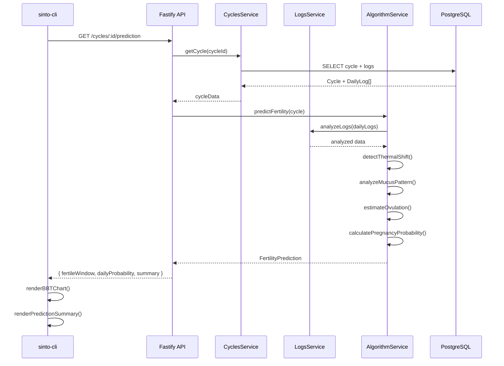
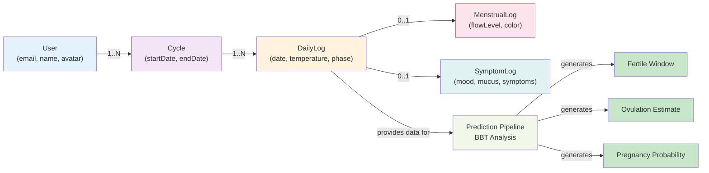
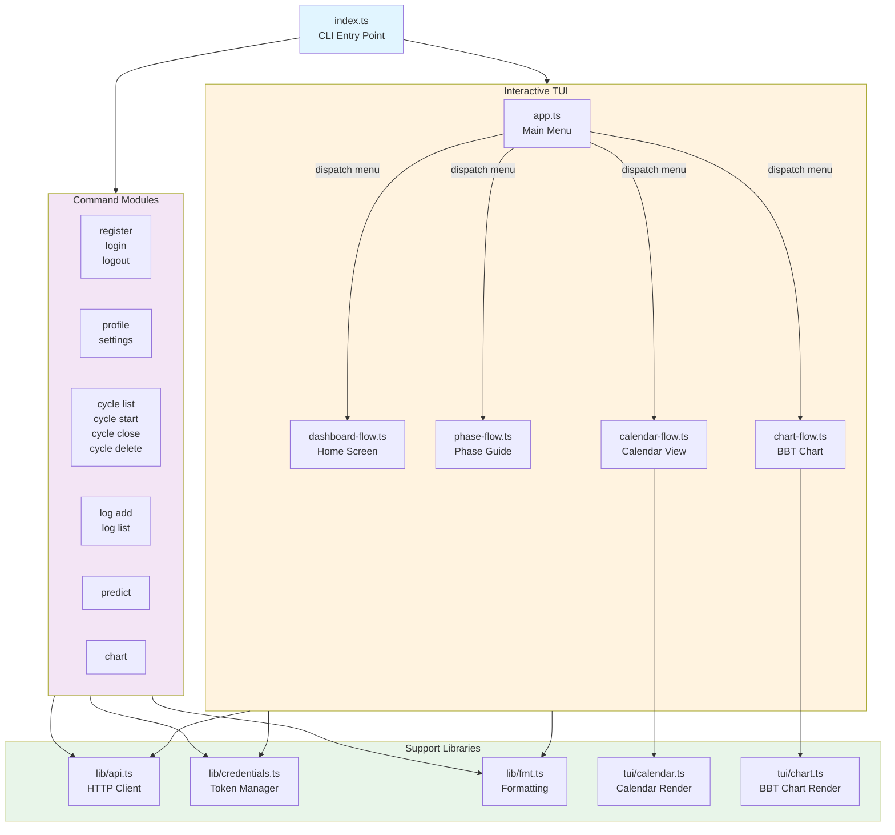
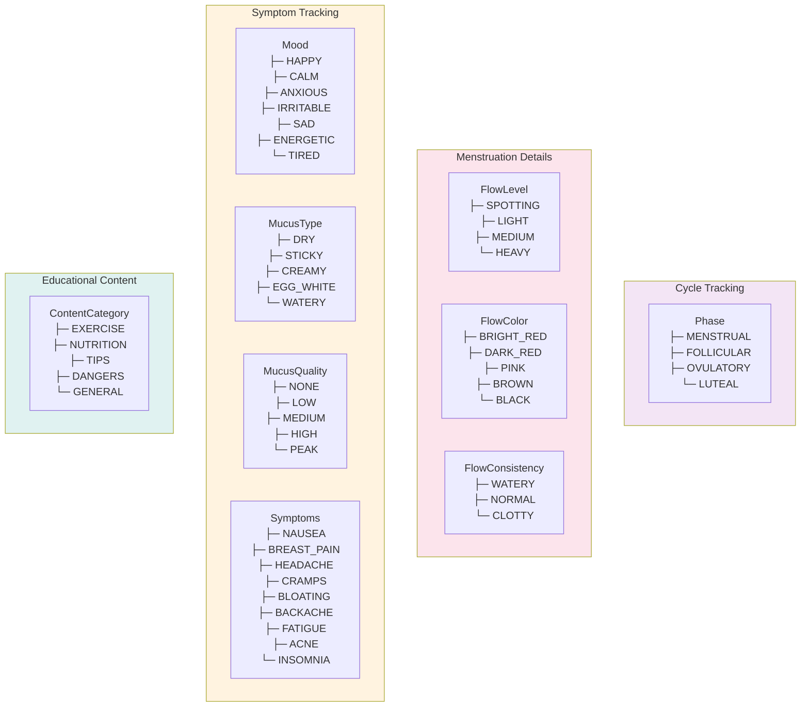

# Sinto App Architecture Diagrams

## 1. Database Schema (ER Diagram)



---

## 2. Module Architecture Diagram



---

## 3. OOP Module Class Diagram

```mermaid
classDiagram
    class AuthService {
        -prisma: PrismaClient
        +register(email: string, password: string, name: string): Promise~User~
        +login(email: string, password: string): Promise~TokenPair~
        +validateToken(token: string): Promise~JWTPayload~
        +refreshToken(refreshToken: string): Promise~TokenPair~
        +logout(userId: string): Promise~void~
        -hashPassword(password: string): Promise~string~
        -verifyPassword(password: string, hash: string): Promise~boolean~
        -generateTokenPair(userId: string): TokenPair
    }

    class UsersService {
        -prisma: PrismaClient
        +getProfile(userId: string): Promise~User~
        +updateProfile(userId: string, data: UpdateUserDto): Promise~User~
        +setReminder(userId: string, time: string): Promise~User~
        +makePublic(userId: string): Promise~User~
        +deleteAccount(userId: string): Promise~void~
    }

    class CyclesService {
        -prisma: PrismaClient
        -algorithmService: AlgorithmService
        +listCycles(userId: string): Promise~Cycle[]~
        +createCycle(userId: string, startDate: Date): Promise~Cycle~
        +getCycle(cycleId: string): Promise~CycleWithLogs~
        +closeCycle(cycleId: string, endDate: Date): Promise~Cycle~
        +deleteCycle(cycleId: string): Promise~void~
        -calculateCycleLength(): number
        -calculateLutealLength(): number
    }

    class LogsService {
        -prisma: PrismaClient
        +addLog(cycleId: string, logData: DailyLogDto): Promise~DailyLog~
        +listLogs(cycleId: string): Promise~DailyLog[]~
        +deleteLog(logId: string): Promise~void~
        +updateLog(logId: string, data: Partial~DailyLogDto~): Promise~DailyLog~
        -validateLogData(data: DailyLogDto): boolean
    }

    class AlgorithmService {
        -prisma: PrismaClient
        +predictFertility(cycle: Cycle): Promise~FertilityPrediction~
        +calculateFertileWindow(logs: DailyLog[]): FertileWindow
        +estimateOvulation(logs: DailyLog[]): Date
        +calculatePregnancyProbability(cycle: Cycle): Promise~PregnancyProbability~
        -detectThermalShift(temperatures: number[]): Date
        -analyzeMucusPattern(logs: DailyLog[]): MucusPhase
        -symmetrothermalMethod(logs: DailyLog[]): SymmetrythermalResult
    }

    class PhasesService {
        -prisma: PrismaClient
        +getPhaseContent(phase: Phase, locale: string): Promise~PhaseContent[]~
        +getCurrentPhase(logs: DailyLog[]): Phase
        +getPhaseDescription(phase: Phase): string
    }

    class NotificationsService {
        -prisma: PrismaClient
        -redis: RedisClient
        +scheduleReminder(userId: string, scheduledAt: Date): Promise~Notification~
        +sendReminder(userId: string): Promise~void~
        +listNotifications(userId: string): Promise~Notification[]~
        +deleteNotification(notificationId: string): Promise~void~
    }

    class PrismaClient {
        +user
        +cycle
        +dailyLog
        +menstrualLog
        +symptomLog
        +phaseContent
        +notification
        +device
    }

    AuthService --> PrismaClient
    UsersService --> PrismaClient
    CyclesService --> PrismaClient
    CyclesService --> AlgorithmService
    LogsService --> PrismaClient
    LogsService --> AlgorithmService
    AlgorithmService --> PrismaClient
    PhasesService --> PrismaClient
    NotificationsService --> PrismaClient
```



---

## 4. Data Flow: Cycle Prediction Pipeline



---

## 5. Entity Relationships: Cycle Tracking



---

## 6. CLI Architecture: Command Flow



---

## 7. Authentication & Token Flow

```mermaid
sequenceDiagram
    participant User as User
    participant CLI as CLI
    participant API as Fastify API
    participant Auth as AuthService
    participant Redis as Redis
    participant DB as PostgreSQL

    User->>CLI: sinto login --email foo --password bar
    CLI->>API: POST /auth/login { email, password }
    
    API->>Auth: login(email, password)
    Auth->>DB: SELECT user WHERE email
    DB-->>Auth: user
    
    Auth->>Auth: verifyPassword(password, hash)
    Auth->>Auth: generateTokenPair(userId)
    Auth-->>API: { accessToken, refreshToken }
    
    API-->>CLI: tokens
    CLI->>CLI: saveCredentials(~/.sinto/credentials.json)
    
    User->>CLI: sinto cycle list
    CLI->>CLI: loadCredentials()
    CLI->>API: GET /cycles with Bearer token
    
    API->>Auth: validateToken(accessToken)
    Auth-->>API: valid
    
    API->>API: return cycles
    API-->>CLI: cycles[]
    
    Note over CLI: If token expires
    CLI->>API: POST /auth/refresh { refreshToken }
    API->>Auth: refreshToken(token)
    Auth->>DB: SELECT user
    Auth->>Redis: checkBlacklist()
    Redis-->>Auth: notBlacklisted
    Auth->>Auth: generateNewAccessToken()
    Auth-->>API: newToken
    API-->>CLI: newAccessToken
    CLI->>CLI: updateCredentials()
    
    style User fill:#e1f5ff
    style CLI fill:#fce4ec
    style API fill:#f3e5f5
    style Auth fill:#fff3e0
```

---

## 8. Key Enums Reference



---

## Diagram Viewing Tips

These diagrams are in Mermaid format and can be viewed in:
- **GitHub**: Markdown files render automatically
- **VS Code**: Install "Markdown Preview Mermaid Support" extension
- **Online**: https://mermaid.live (paste the code blocks)
- **Claude**: Mermaid diagrams render inline in conversations

To view locally with better rendering, you can use a Mermaid CLI tool:
```bash
npm install -g @mermaid-js/cli
mmdc -i DIAGRAMS.md -o DIAGRAMS.html
```
