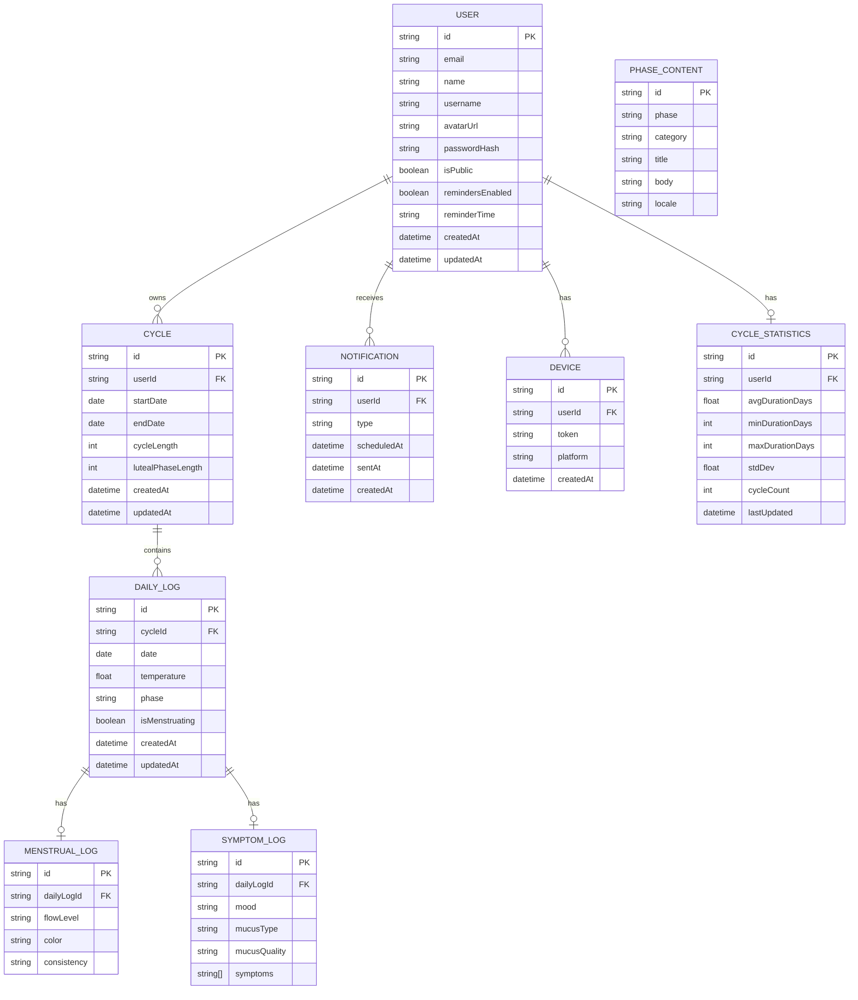

# Database ER Diagram

This diagram shows the relationships between all Prisma models in the Sinto application, including users, cycles, daily logs, notifications, devices, and cycle statistics.



## Enums

```
Phase: MENSTRUAL, FOLLICULAR, OVULATORY, LUTEAL
FlowLevel: SPOTTING, LIGHT, MEDIUM, HEAVY
FlowColor: BRIGHT_RED, DARK_RED, PINK, BROWN, BLACK
FlowConsistency: WATERY, NORMAL, CLOTTY
Mood: HAPPY, CALM, ANXIOUS, IRRITABLE, SAD, ENERGETIC, TIRED
MucusType: DRY, STICKY, CREAMY, EGG_WHITE, WATERY
MucusQuality: NONE, LOW, MEDIUM, HIGH, PEAK
Symptom: NAUSEA, BREAST_PAIN, HEADACHE, CRAMPS, BLOATING, BACKACHE, FATIGUE, ACNE, INSOMNIA
ContentCategory: EXERCISE, NUTRITION, TIPS, DANGERS, GENERAL
```
