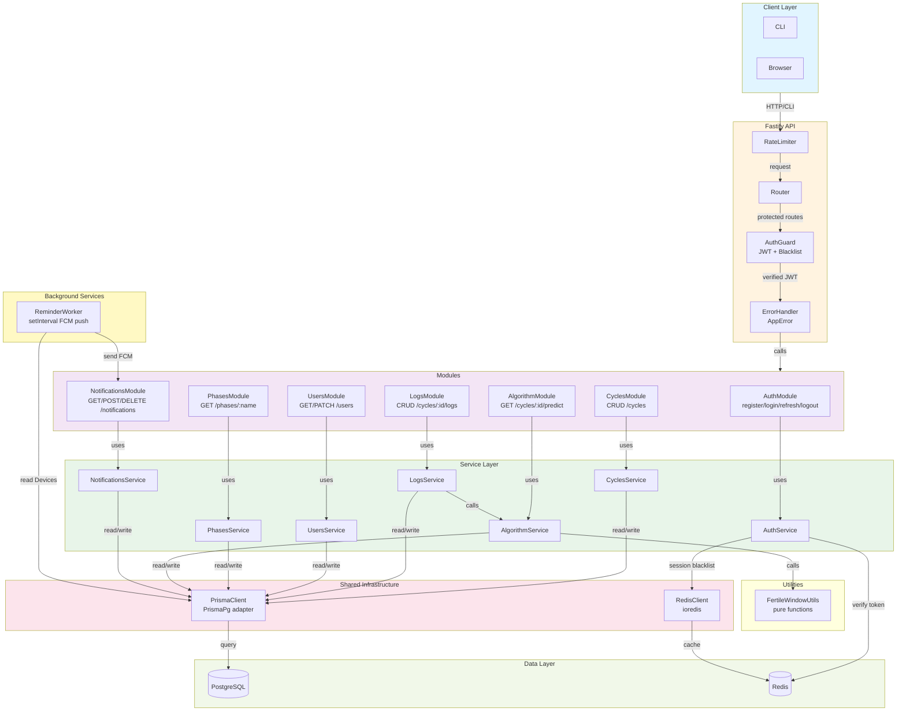

# Module Architecture Diagram

This diagram illustrates the request flow, module structure, shared utilities, and background services in the sinto-app Fastify API.

The architecture demonstrates:
- **Request pipeline**: Client → Rate Limiter → Router → Auth Guard → Route Handler → Service Layer → Database
- **Module organization**: Each module (Auth, Cycles, Logs, Users, Phases, Algorithm, Notifications) encapsulates related routes and service logic
- **Cross-module dependencies**: LogsService calls AlgorithmService; AlgorithmService uses pure function utilities
- **Shared infrastructure**: Centralized Prisma and Redis clients; AppError exception handling; Auth Guard middleware
- **Background work**: ReminderWorker independently polls the database to send push notifications via FCM

