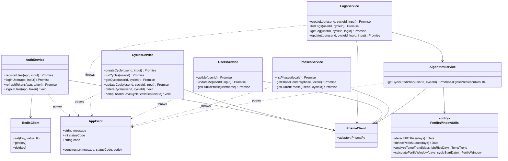

# Services UML Class Diagram

This diagram illustrates the architecture of the Sinto API service layer, showing relationships between core services, shared utilities, and error handling.

```mermaid
classDiagram
    class AppError {
        +string message
        +int statusCode
        +string code
        +constructor(message, statusCode, code)
    }

    class PrismaClient {
        +adapter: PrismaPg
    }

    class RedisClient {
        +set(key, value, ttl)
        +get(key)
        +del(key)
    }

    class FertileWindowUtils {
        <<utility>>
        +detectBBTRise(days) Date
        +detectPeakMucus(days) Date
        +analyzeTempTrend(days, bbtRiseDay) TempTrend
        +calculateFertileWindow(days, cycleStartDate) FertileWindow
    }

    class AuthService {
        +registerUser(app, input) Promise
        +loginUser(app, input) Promise
        +refreshTokens(app, token) Promise
        +logoutUser(app, token) void
    }

    class CyclesService {
        +createCycle(userId, input) Promise
        +listCycles(userId) Promise
        +getCycle(userId, cycleId) Promise
        +updateCycle(userId, cycleId, input) Promise
        +deleteCycle(userId, cycleId) void
        +computeAndSaveCycleStatistics(userId) void
    }

    class LogsService {
        +createLog(userId, cycleId, input) Promise
        +listLogs(userId, cycleId) Promise
        +getLog(userId, cycleId, logId) Promise
        +updateLog(userId, cycleId, logId, input) Promise
    }

    class UsersService {
        +getMe(userId) Promise
        +updateMe(userId, input) Promise
        +getPublicProfile(username) Promise
    }

    class PhasesService {
        +listPhases(locale) Promise
        +getPhaseContent(phase, locale) Promise
        +getCurrentPhase(userId, cycleId) Promise
    }

    class AlgorithmService {
        +getCyclePrediction(userId, cycleId) Promise~CyclePredictionResult~
    }

    AuthService --> PrismaClient
    AuthService --> RedisClient
    CyclesService --> PrismaClient
    LogsService --> PrismaClient
    LogsService --> AlgorithmService
    UsersService --> PrismaClient
    PhasesService --> PrismaClient
    AlgorithmService --> PrismaClient
    AlgorithmService --> FertileWindowUtils
    AuthService ..> AppError : throws
    CyclesService ..> AppError : throws
    LogsService ..> AppError : throws
    UsersService ..> AppError : throws
    PhasesService ..> AppError : throws
    AlgorithmService ..> AppError : throws
```
